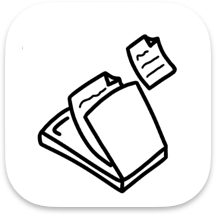

# SaneScanner

## What is it?

An iOS app connecting to your [SANE](http://www.sane-project.org/) server, using the appropriate `net` backend, to scan documents from your iOS or macOS device!

To make it work:

- add your server IP address or hostname,
- tap your device once it's found
- scan!

Scanned documents can be shared as a multi-page PDF or as individual images via the iOS share dialog.

## Screenshots

&nbsp;&nbsp;&nbsp;&nbsp;&nbsp;&nbsp;&nbsp;&nbsp;&nbsp;&nbsp;

## Useful links

The following links have helped me a great deal in the making of this app, if you're building a desktop lib for iOS you may find them useful to!

##### CrossCompiling Sane

- <https://github.com/tpoechtrager/cctools-port/issues/6>
- <https://github.com/obfuscator-llvm/obfuscator/issues/13>
- <https://help.ubuntu.com/community/CompileSaneFromSource>
- <http://stackoverflow.com/questions/26812060/cross-compile-libgcrypt-static-lib-for-use-on-ios>
- <https://ghc.haskell.org/trac/ghc/wiki/Building/CrossCompiling/iOS>

##### Sane API doc

- <http://www.sane-project.org/html/doc012.html>

##### Other Sane projects

- <https://github.com/chrspeich/SaneNetScanner>
- <https://hackaday.io/project/172440-simple-saned-front-end-for-osx>

